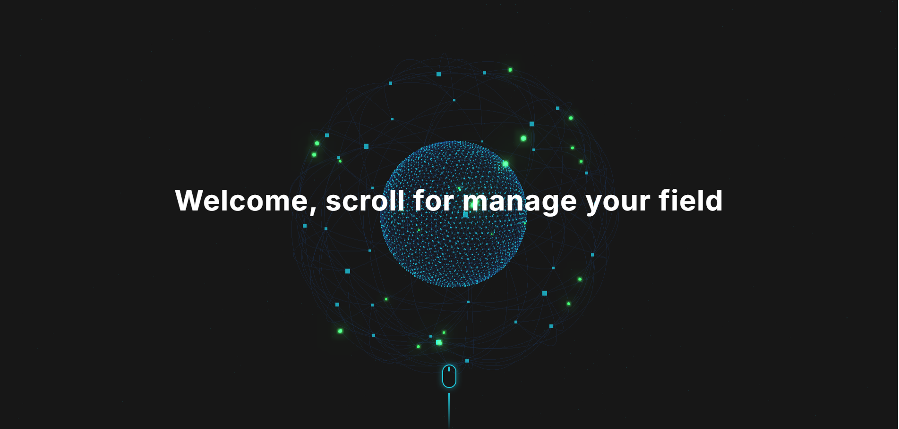
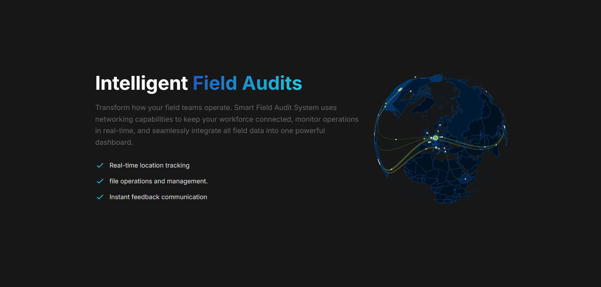
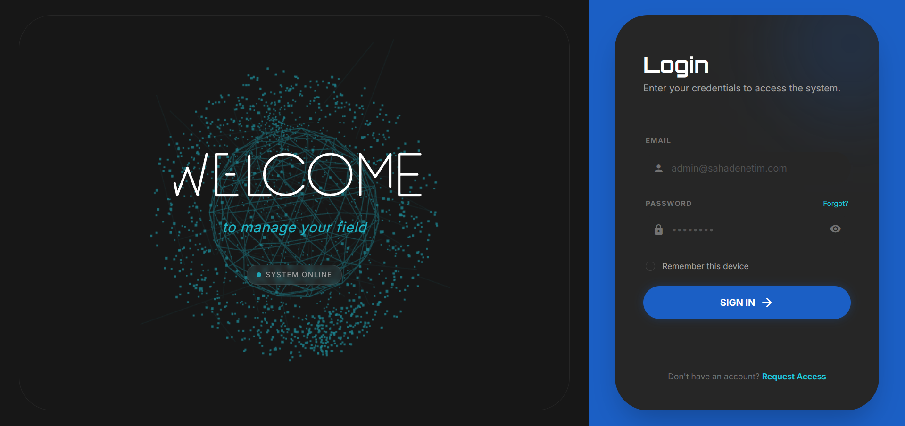
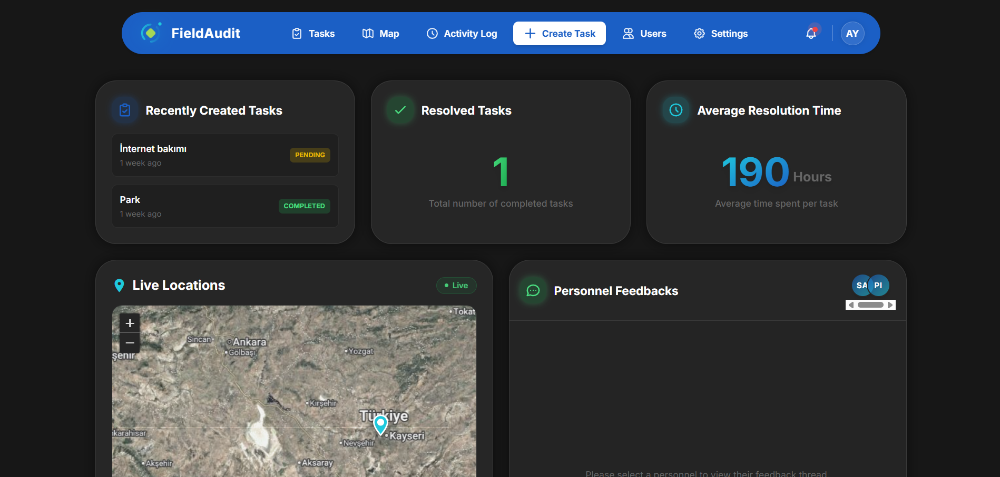

<div align="right">
  <a href="README.md">🇬🇧 English</a> | 🇹🇷 <b>Türkçe</b>
</div>

# Akıllı Saha Denetim Sistemi (Smart Field Audit System)

Akıllı Saha Denetim Sistemi, saha personellerinin, bölge yöneticilerinin ve sistem yöneticilerinin saha operasyonlarını, görev dağılımlarını ve denetim süreçlerini dijital ortamda sorunsuz ve verimli bir şekilde yönetmelerini sağlayan kapsamlı bir Laravel web uygulamasıdır.

## 📸 Ekran Görüntüleri

Aşağıdaki ekran görüntüleri sistemin genel görünümü ve işleyişi hakkında fikir vermektedir:

**1. Karşılama Ekranı (Welcome)**


**2. Özellikler ve Sunum**


**3. Giriş Sayfası (Login)**


**4. Yönetim Paneli (Dashboard)**


## 🚀 Temel Özellikler

- **Gelişmiş Rol ve İzin Yönetimi (RBAC)**
  - **Admin:** Tüm sistemi, kullanıcıları ve ayarları yönetir.
  - **Yönetici (Manager):** Saha personellerine görev atar, denetim noktalarını yönetir ve süreçleri takip eder.
  - **Saha Personeli (Field Personnel):** Kendisine atanan görevleri üstlenir (claim), tamamlar ve kanıt niteliğinde dosya/fotoğraf ekleyebilir.

- **Görev ve Operasyon Yönetimi**
  - Görev oluşturma, atama, durum güncelleme (bekliyor, devam ediyor, tamamlandı vb.).
  - Görevlere kanıt niteliğinde çoklu dosya ve medya yükleme (Spatie Media Library altyapısı ile).

- **Denetim Noktaları (Audit Points) ve Harita Entegrasyonu**
  - Coğrafi konum (enlem/boylam) destekli denetim noktaları.
  - **Leaflet.js** entegrasyonu sayesinde harita üzerinden konum seçme ve görüntüleme.

- **İzlenebilirlik ve Güvenlik**
  - Tüm kritik işlemlerin (CRUD) arka planda otomatik olarak kayıt altına alınması (Spatie Activitylog).
  - Aktivite geçmişi (Activity Logs) ekranı ile kimin, ne zaman, hangi işlemi yaptığının takibi.

- **Geri Bildirim ve Bildirim Sistemi**
  - Personeller ve yöneticiler arası geri bildirim geçmişi.
  - Yeni bir olay olduğunda sistem içi anlık bildirim (Notification) altyapısı.

- **Dışa Aktarma ve Raporlama**
  - Excel (Maatwebsite Excel) ve PDF (DomPDF) formatlarında zengin rapor çıktısı alabilme yeteneği.
  - Denetim noktaları için QR Kod (Simple Qrcode) üretimi.

## 🛠️ Kullanılan Teknolojiler ve Paketler

**Backend**
- PHP 8.3+
- Laravel 11.x
- MySQL / SQLite

**Frontend**
- Tailwind CSS (Stil)
- Alpine.js (Etkileşim)
- Vite (Asset Yönetimi)
- Leaflet.js (Haritalar)
- Anime.js (Animasyonlar)

**Öne Çıkan Laravel Paketleri**
- `spatie/laravel-permission`: Rol ve yetki yönetimi
- `spatie/laravel-medialibrary`: Medya yönetimi
- `spatie/laravel-activitylog`: Sistem günlükleri
- `barryvdh/laravel-dompdf`: PDF oluşturma
- `maatwebsite/excel`: Excel işlemleri
- `simplesoftwareio/simple-qrcode`: QR kod oluşturma

## ⚙️ Kurulum ve Çalıştırma

Projeyi yerel ortamınızda çalıştırmak için aşağıdaki adımları izleyin:

1. **Depoyu Klonlayın**
   ```bash
   git clone https://github.com/AyberkCerit/smart-field-audit-system.git
   cd file_management_service
   ```

2. **Bağımlılıkları Yükleyin**
   ```bash
   composer install
   npm install
   ```

3. **Çevre Değişkenlerini Ayarlayın**
   ```bash
   cp .env.example .env
   php artisan key:generate
   ```
   `.env` dosyanızı açarak veritabanı ayarlarınızı (DB_*) kendi yerel sunucunuza göre yapılandırın.

4. **Veritabanı Migrasyonları ve Sahte Veri (Seeder)**
   Sistemin sorunsuz çalışması (Rollerin ve örnek verilerin oluşması) için veritabanını oluşturup seed etmeniz gerekir:
   ```bash
   php artisan migrate --seed
   ```
   *Not: Seed işlemi sonrasında `admin@sahadenetim.com` (şifre: password) hesabı ve çeşitli test verileri otomatik olarak oluşturulacaktır.*

5. **Uygulamayı Başlatın**
   Sunucuyu ve frontend asset'lerini eşzamanlı olarak çalıştırmak için:
   ```bash
   npm run dev
   php artisan serve
   ```
   *İsteğe bağlı: E-posta ve asenkron bildirimler için `php artisan queue:listen` çalıştırılabilir.*

## 🔒 Güvenlik Notları

- API ve dışa açık formlarda CSRF koruması aktiftir.
- Rol bazlı yetkilendirmeler tüm Route yapılarında, Policy ve Controller seviyelerinde sıkı bir şekilde uygulanmıştır.
- Canlı ortama çıkmadan önce `.env` dosyasındaki `APP_DEBUG` değerinin `false` olduğundan emin olun.
